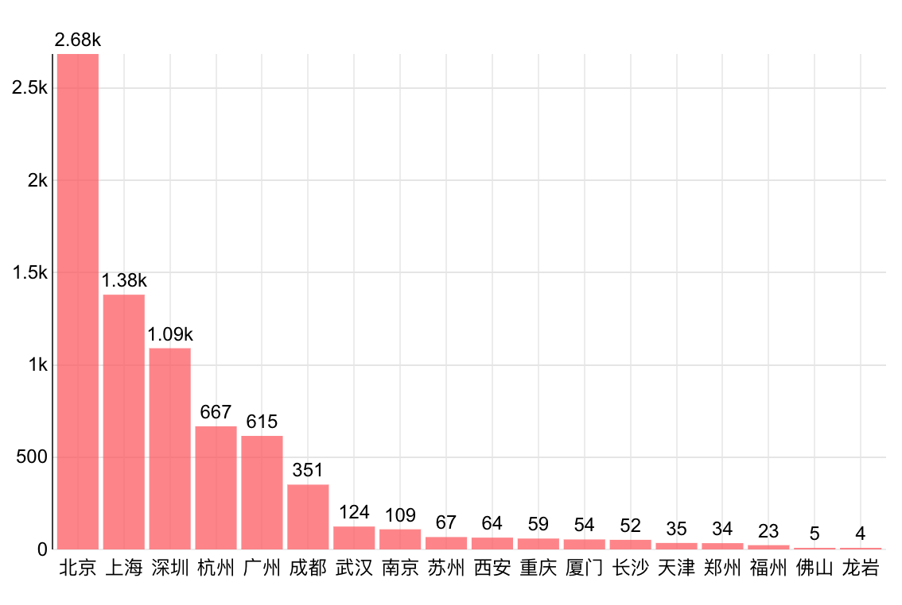

# 数据分析岗位需求和薪酬分析报告

## 一、项目简介

本项目基于不同地域、学历、工作经验、技能要求等多维度分析数据分析岗位的需求和薪酬情况，可为求职数据分析岗位的人员提供参考信息。

## 二、数据来源和数据字段

### 1、数据来源

本项目的数据（数据分析岗位招聘信息）来源于拉勾网，共7434条。

### 2、数据字段

-  position（职位信息表）

  | positionId | companyId | city | positionName | firstType | secondType | thirdType | salary   | education | jobNature | workYear | industryField | positionLables | skillLables | detail   |
  | ---------- | --------- | ---- | :----------: | --------- | ---------- | --------- | -------- | --------- | --------- | -------- | ------------- | -------------- | ----------- | -------- |
  | 职位ID     | 公司ID    | 城市 |   职位名称   | 所属大类  | 所属二类   | 所属三类  | 薪资区间 | 学历      | 职位性质  | 工作经验 | 所属行业      | 职位标签       | 技能标签    | 岗位详情 |

- company（公司信息表）

  | companyId | companyFullName | companySize | financeStage | companyLabelList | businessZones |
  | --------- | --------------- | ----------- | ------------ | ---------------- | ------------- |
  | 公司ID    | 公司全名        | 公司规模    | 融资阶段     | 公司标签         | 所在商圈      |

## 三、技术和工具

本项目分为数据获取、数据处理、数据分析、数据可视化四个阶段，每个阶段会使用合适的技术和工具处理。

### 1、数据获取

编写**python**爬虫爬取数据（[**点击查看源码**](https://github.com/kikoxxxi/lg_data_analysis/tree/master/lg_spider)）

主要包括使用requests请求数据，编写re正则表达式和xpath提取并清洗所需字段

### 2、数据处理

使用**python**的jieba对职位描述进行分词处理和**re**正则清洗数据

利用**Excel**的数据透视、函数、高级筛选等功能对原始数据进行字段拆分提取和数据清洗筛选

### 3、数据分析

编写**SQL**统计分析数据，以及python的**pandas**处理绘制箱线图数据

### 4、数据可视化

分别利用**superset**、python的**seaborn**、**powerBI**进行数据可视化

## 四、数据分析

### 1、不同城市的岗位需求量

#### sql查询语句

过滤掉需求量少于3的城市

```{mysql}
SELECT city AS city, COUNT(*) AS count
FROM position
GROUP BY city
HAVING count > 3
ORDER BY count DESC
```

#### 分析



从上图可以看出，岗位需求主要集中在五大城市——北京、上海、深圳、杭州、广州，这五个城市的需求总和几乎占了90%。相比而言，其他城市的岗位需求量就非常小了。因为大量工作机会集中在北上广深杭，所以数据分析岗的求职者可以考虑到这些城市去发展。

### 2、不同城市的薪酬水平

#### python脚本

```{python}
import pandas as pd
import matplotlib.pyplot as plt
import seaborn as sns
plt.rcParams['font.family'] = ['sans-serif']
plt.rcParams['font.sans-serif'] = ['SimHei']

df=pd.read_csv('./lg_position.csv',encoding='utf-8')

data=pd.DataFrame(position, columns=["city","companyId", "education","workYear","positionId", "bottomSalary","topSalary","avgSalary"])
position_data=data.query('city in ["北京","上海","广州","深圳","杭州"]')

plt.yticks(range(0,50,3))
plt.ylim(0, 45)
sns.boxplot(x="city",y="bottomSalary",palette=sns.color_palette("Accent"),showmeans=True,data=position_data)

```

#### 分析


声明：

- 这里包括下文只选取需求量最大的五个城市的数据（共6436条）进行分析
- 因为Superset的箱线图不能标示均值也不能设置刻度，不如基于matplotlib实现的seaborn包灵活，所以这里采用seaborn数据可视化（绿色三角形代表均值）
- 拉勾网提供的薪酬是一个区间，为了方便处理，利用Excel的文本函数进行字段拆分提取出薪酬区间的下限作为依据来分析

从上图可以得出几个结论：

- 北京的薪酬均值和中位数大约20K，位居首位，求职者在北京发展是一个不错的选择
- 深圳、杭州、上海三地的均值高于中位数，说明存在偏斜数据和异常值使薪酬均值被拉高，所以大量岗位薪酬应该是集中在比均值略小的区域。深圳和杭州的薪酬约15K，上海约17K
- 广州的薪酬均值和中位数几乎重合且靠近三分位值，说明广州的薪酬比较集中在比中位数略低的位置，约12K

### 3、不同学历岗位需求分布


学历要求本科占了绝大部分，说明求职者至少要有本科学历才会有比较多的机会。硕士以上学历的需求量并不大，求职大可不必因为没有足够高的学历而畏惧。

### 4、不同学历薪酬水平


从博士、硕士到本科、大专，随着学历的降低薪酬也是逐渐降低的。

### 5、不同工作经验岗位需求分布


1年以上10年以下工作经验的需求几乎占了80%，其中3-5年经验的更受公司亲睐，需求占了一半多。工作经验不足1年的新人，市场需求量比较少，10年以上的更是凤毛麟角。

### 6、不同工作经验薪酬水平


随着工作经验的提升，数据分析师的收入也就越高，符合常理。另外应届生的均值远高于中位数，说明存在偏斜数据和异常值使薪酬均值被拉高，同样说明存在少量企业愿意出比较高的价格来雇佣应届生，所以如果觉得自己水平还不错的应届生，可以试试挑战高薪数据分析应届生岗位。

### 7、不同规模的企业岗位需求分布

#### sql查询语句

```mysql
SELECT companySize, count(`positionId`) AS `COUNT(positionId)`
FROM
    (SELECT p.*, c.companySize
     FROM position AS p
     LEFT JOIN company AS c 
     ON p.companyId=c.companyId) AS expr_qry
WHERE city IN ('杭州', '深圳', '北京', '上海', '广州')
GROUP BY companySize
ORDER BY `COUNT(positionId)` DESC
```

#### 分析


显而易见，越是规模大的公司需求越大，求职者可以期待进入大公司工作。一般而言，大公司的数据量会很大，所以对数据分析师的需求自然会比小公司多。

### 8、不同规模的企业薪酬水平

#### python脚本

```{python}
company_position = pd.merge(position_data, company, how='inner', on='companyId',sort=True, suffixes=('_x', '_y'), copy=False)
plt.yticks(range(0,52,3))
plt.ylim(0, 52)
sns.boxplot(x="companySize",y="bottomSalary",showmeans=True,data=company_position)
```

#### 分析


从图中看出，除去少于15人的公司，随着公司的规模减小，给数据分析师的薪酬均值是逐渐减少的。少于15人的公司给出的薪酬还不错，可能因为公司初创，需要更多的是经验比较丰富的数据分析师，所以开出的薪资比较高。

### 9、企业对不同工作经验的求职者的要求

首先使用**python**的**jieba**对职位描述进行分词处理和**re**正则清洗数据，最后用superset可视化

#### 分析

一年以下工作经验（包括应届生）


一年以上工作经验


从以上两张图中可以得出几个重要结论：

- 企业对于不论是拥有一年以下还是一年以上工作经验的求职者，都是要求熟悉基础工具与技术、懂业务和产品运营
- 企业对于一年以下工作经验者要求侧重于学历、基础工具的熟悉程度，其中工具最主要的依次为Python、SQL、Excel。所以，应届生、刚转行的或者有一年工作经验的求职者可以加强这几项技能的练习，提高技术能力来弥补不懂业务和产品的不足
- 企业对于一年以上工作经验者要求侧重于实际工作经验、业务能力、管理能力、团队领导

### 10、基础工具的需求分布

利用re正则提取出职位详情中的基础工具进行需求统计


#### 分析

字体越大代表需求量越大，大致顺序为Python、sql、Hadoop、spark、hive、java、excel等。市场上最需要的是熟练掌握上述一项或其中好几项工具的数据分析师。

### 11、不同基础工具对薪酬的影响

这里过滤掉需求量小于450的基础工具的数据。横轴和气泡的大小都代表岗位的需求量，纵轴代表薪酬均值（取薪酬下限和薪酬上限的平均值）


#### 分析

- 代表“大数据”方向的flink、storm、Hadoop、spark、hive这几个技能的薪酬均值达到了20K以上，另外Hadoop、spark、hive、java这四项技能位于图中右上角，代表不仅薪酬高而且需求量也大，可谓性价比超高的技能
- Python、r、sql、bi这几个技能的薪酬也是不错的，位于16-18K区间，另外Python和SQL位于图中最右侧，代表需求是最大的
- excel、ppt技能位于图中底部区间，只掌握这两项基础技能，薪酬是最低的，约13K，所以求职者想要获得不错的薪资，还是要学习上面其他技能

## 五、总结与建议

1. 数据分析岗位有大量的工作机会集中在北上广深以及杭州，求职者可以考虑到这些城市去发展
2. 北京、上海、深圳、杭州、广州的薪资分别约20K、17K、15K、15K、12K，每个城市都有少数公司愿意提供极高的薪酬，所以，求职者如果对自己的技术和业务能力等有足够的信心，可以尝试挑战高薪工作机会
3. 学历要求本科占了绝大部分，求职者只要有本科学历或以上会有比较多的工作机会，但是想拿极高的薪水，需要博士学历
4. 3-5年工作经验的求职者市场需求量最多，其次是5-10年、1-3年，所以对于刚转行和应届生这些新人来说，竞争会非常激烈
5. 随着经验的提升，数据分析师的薪酬也在不断提高，10年以上工作经验的人，能获得相当丰厚的薪酬
6. 越是规模大的公司数据分析岗位需求越大，求职者可以期待进入大公司工作
7. 除去少于15人的公司，随着公司的规模减小，给数据分析师的薪酬均值是逐渐减少的。工作经验比较丰富的求职者也可以取小公司试试运气，有机会得到不错的薪资待遇
8. 企业对于数据分析师的基本要求是熟悉基础工具与技术、懂业务和产品运营
9. 企业对于一年以下工作经验者要求侧重于学历、基础工具的熟悉程度，其中工具最主要的依次为Python、SQL、Excel。所以，应届生、刚转行的或者有一年工作经验的求职者可以加强这几项技能的练习，提高技术能力来弥补不懂业务和产品的不足
10. 企业对于一年以上工作经验者要求侧重于实际工作经验、业务能力、管理能力、团队领导
11. 数据分析师技能需求频率排在前列的有：Python、sql、Hadoop、spark、hive、java、excel等
12. 代表“大数据”方向的flink、storm、Hadoop、spark、hive这几个技能的薪酬均值达到了20K以上，另外Hadoop、spark、hive、java这四项技能不仅薪酬高而且需求量也大，可谓性价比超高的技能，求职者想要高薪，还是得朝着大数据方向努力
13. Python、r、sql、bi这几个技能的薪酬也是不错的，位于16-18K区间，另外Python和SQL这两项技能的需求是最大的，求职者可以考虑优先掌握这两项技能，快速获得工作机会
14. 只掌握excel、ppt这种基本人人都会的技能，薪酬是最低的，约13K，所以求职者想要获得不错的薪资，还是要学习上面其他技能


